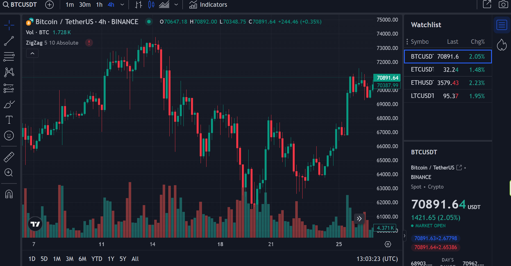

## TradingView Chart Widget Embedding

### Introduction
This guide helps embed TradingView chart widgets into web pages to display financial market data with customization.



### Getting Started
1. **Include TradingView Library**: Add the TradingView library to your HTML file.

2. **Create a Container**: Use an HTML element as the chart container (e.g., `<div id="chart">`).

3. **Configure Widget Options**: Customize the chart widget with JavaScript object properties.

4. **Instantiate Widget**: Create the chart widget using `new TradingView.widget()`.

5. **Embed Widget**: Add the widget to the container element.

### Example
```html
<!DOCTYPE html>
<html lang="en">
<head>
    <meta charset="UTF-8">
    <meta name="viewport" content="width=device-width, initial-scale=1.0">
    <title>TradingView Chart</title>
    <script type="text/javascript" src="https://s3.tradingview.com/tv.js"></script>
</head>
<body>
    <div id="chart"></div>

    <script type="text/javascript">
        // Customize widget options here
        var widgetConfig = {};
        new TradingView.widget(widgetConfig);
    </script>
</body>
</html>
```

### Customization
Modify properties like symbol, interval, theme, etc., in the configuration object for customization.
